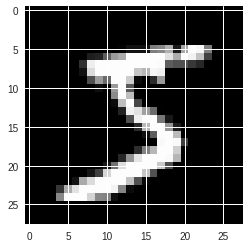
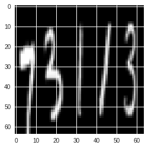
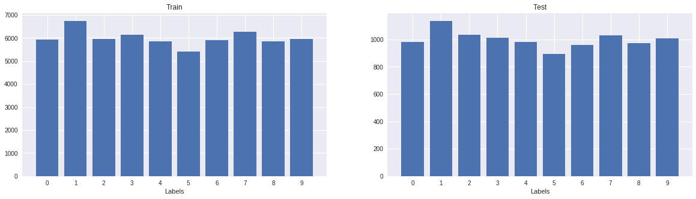
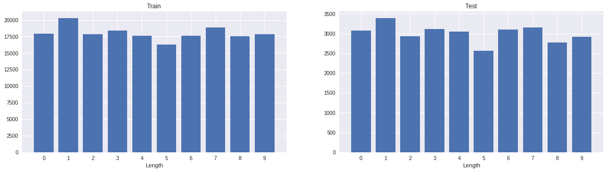
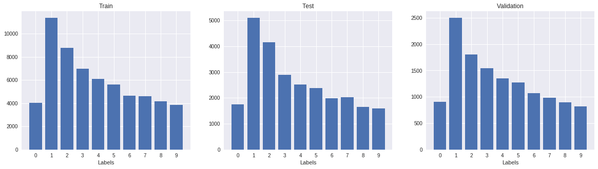
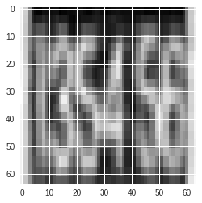
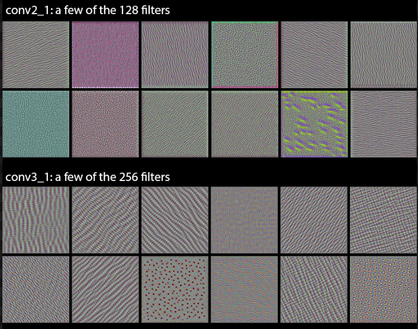
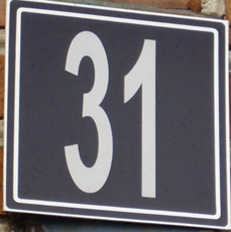

# Machine Learning Engineer Nanodegree

## Capstone Project

Ozan Pekmezci
May 18th, 2018

## I. Definition

### (approx. 1-2 pages)

### Project Overview

The aim of this project at hand is to build a software to detect house numbers on streets. The project was featured in the Deep Learning course of Udacity.

The domain is number recognition on videos. The app recognizes the numbers on the live image and shows it to the user. This project used [Google's paper](<http://static.googleusercontent.com/media/research.google.com/en//pubs/archive/42241.pdf>) as a reference point. The paper explains Google's way to recognize multi-digit numbers from static Street View images using Deep Convolutional Neural Networks. This project also does the same using a different architecture. The best part of this project is the combination of Machine Learning with Software Engineering which are the field of interests of the author.

The project was split into three steps. The first being the digit recognition using synthetic dataset. Second one was using doing the same with real street number data and third the Android app implementation, which was optional on Udacity Deep Learning course. For the first step, MNIST dataset was used. MNIST is database that contains handwritten digits. Therefore, they are actually not the best to detect multi-digit street numbers. That's why the digits from MNIST were concatenated to simulate house numbers on streets. The second step uses SVHN dataset, which contains house numbers images acquired from Google Street View. Lastly, third step also was supposed to SVHN dataset, but it didn't came to life during the scope of this capstone due to the reason that Tensorflow Apps never ran on my phone.

### Problem Statement

The problem is the fact that house numbers have different formats. The numbers can appear with non-standard baseline, broken outlines, non-standard fonts or bad localization. The goal was recognizing all of those cases.

The strategy to solve this problem is using Convolutional Neural Networks with Tensorflow framework. The end solution runs on Android operating system to increase portability. MNIST and SVHN datasets are used to train and test data. The algorithm receives images as an input and extracts digits from them if there are any.

### Metrics

The metrics are coverage, overall accuracy and per character accuracy. In the first phase of the project, we achieved 91.77% overall accuracy and 98.24% per character accuracy. For coverage, we define a confidance threshold and discard the predictions that are less likelier than the threshold. Coverage is the proportion of non-discarded values to all values.

## II. Analysis

### (approx. 2-4 pages)

### Data Exploration

The main dataset to be used for this type of a problem is the SVHN dataset, which contains Google Street View House Numbers data, however the author chose MNIST database for the beginning. The reason is simple, MNIST database provides handwritten numbers and SVHN contains sequence of digits. That's why the initial idea was concatenating MNIST characters to form an artificial dataset so that we can avoid problematic situtations that occur on house numbers like digits being upside-down, containing some lines inbetween or written in another artistic way.

According to its [official website](<http://yann.lecun.com/exdb/mnist/>), MNIST dataset contains 60,000 training and 10,000 testing examples. All digits are normalized centered in a fixed-size image, which makes it a good choice for machine learning since it handles pre-processing steps for you. Another reason to use MNIST initially is the fact that, it is easy to import via Keras. Keras is a machine learning frontend that serves as an abstraction layer to run different machine learning backends like Tensorflow. It also is really easy to import MNIST with the line:

```from keras.datasets import mnist```


.After that, The dataset is minimal and has the size of 11 Megabytes. Each of the images are basically 28 by 28 pixels. Although they preserve color values, the software at hand transforms the images to black and white and uses them like that. This creates no problems, since different colors don't change the ability to recognize different digits on the images.


*Example data point from MNIST*


For the second stage of the capstone, a synthetic MNIST dataset is generated. Since 99.99% of the SVHN dataset contains house number length less than 5, the maximum length of the synthetic dataset set to be 5. This means that MNIST data points are stitched together to become data points with the length between 1 and 5. To do that, the blank character is utilized with the label 10. For example, this example has the label (7, 3, 1, 1 3).


*Example from multi-digit MNIST*


The SVHN dataset on the other hand, is much [bigger](<http://ufldl.stanford.edu/housenumbers/>), has the size more than 200 megabytes. It contains 73257 training and 26032 testing examples. Those examples are directly extracted from Google Maps Street View, that's why all data are found in their real environment. By default, there are 10 classes, 1 for each digit. Digit '1' has label 1, '9' has label 9 and '0' has label 10. However, in our case, digit '0' has the label 0 and label 10 corresponds to the blank character. That's why a preprocessing is required. SVHN dataset comes in two different formats; format 1 contains original images with bounding boxes around characters. Format 2 has MNIST-like 32-by-32 images centered around a single character, which we used so that we can use similar model architectures for different versions. The original character bounding boxes are extended in the appropriate dimension to become square windows, so that resizing them to 32-by-32 pixels does not introduce aspect ratio distortions. However, getting and importing is as not easy as importing MNIST data since the dataset is provided in `.mat` format. The dataset should be downloaded and the data should be extracted from the dataset programatically.


*Example data from SVHN*

### Exploratory Visualization

#### Amount of labels on MNIST dataset





MNIST dataset contains examples of each digits in a fairly balanced way. The label 1 seems more than others and label 5 seems to be a bit less than others.


#### Amount of labels on Synthetic MNIST dataset





Generated MNIST dataset contains digits with the maximum length of 5. Since they were set randomly, the distribution stayed the same as on single digit MNIST.


#### Amount of labels on SVHN dataset





SVHN dataset looks like left-skewed bell curve that has the most examples of the label 1. The occurances of labels gets less and less starting from the label 2. Labels 0 and 9 seems to be the lowest for house numbers.


### Algorithms and Techniques

For the problem at hand, the author used Convolutional Neural Networks to predict digits from the images. Convolutional Neural Networks are ideal for image recognition, since they don't flatten the nodes, which removes the logic out of images.

Another software that the author would normally use was developing an Android application but there were compilation problems that couldn't be fixed for months, which moved that part to the backlog, which will be developed after this nanodegree ends.

### Benchmark

As benchmark we use the model that is specified in Google's paper. Image as input, hidden layers and an output layer that contains nodes that represent a digit each. The paper also mentions benchmark values for accuracy.

These benchmark values are coverage, overall accuracy and per character accuracy. The authors of the paper achieved 96.5% coverage, 96% overall accuracy and 97.8% per character accuracy. For coverage, we define a confidance threshold and discard the predictions that are less likelier than the threshold. Coverage is the proportion of non-discarded values to all values.

The model that was developed during the scope of this project, achieved the overall accuracy of 87.2% and per character accuracy of 96.8%. When the confidence threshold 70% was chosen, the coverage was 96.5%. However, the confidence threshold being 100% resulted the coverage being 46.7%. Therefore, algorithm is only 100% sure about the results of half of the data.

## III. Methodology

### (approx. 3-5 pages)

### Data Preprocessing

Data preprocessing is different for different steps of the project. For the first step, which is using MNIST for single digit recognition, the data is reshaped based on the image data format of the Keras instance, images are turned into gray to reduce complexity, then the RGB values values are normalised to be in the range 0 to 1 that is always beneficial for machine learning algorithms. Lastly, the labels are one-hot-encoded from class vector to binary class matrices, which again is required for machine learning algorithms to function well.


The second step is generating synthetic MNIST data and building image recognition model up to 5 consecutive digits. There, the author did what he did on the first step, plus a synthetic dataset is built. To do that, first a random length for each data is selected. Then, random indices are selected for each element. Next, the images and labels are stitched together to resemble actual data points and images. Lastly, blank images and their labels 10 are added to the required locations followed by resizing the resulting images to their right size, which is 64 to 64.


Last step was doing the same with the SVHN dataset. However, SVHN dataset is much harder to import than MNIST. That's why it needs more steps. First, the dataset gets downloaded, unpacked and extracted. We use `h5py` to import the  `.mat` files, so that we can reach file contents for each digit, like the position of the boxes around digits, label and the file name. After that, we use the the information about the box to crop the parts outside to remove irrelevant sections of the images. Then the concrete training and testing data points are acquired. There are 33402 data points, labels in the training set and 13068 in the training set. Only one of them in training set has the digit length more than 5. Since we set the the maximum length to 5, this data point is removed by the algorithm.

*Removed element of SVHN dataset that contains 6 digits*

Another concern that the author had, was the fact that SVHN dataset only provides testing and traning sets by default. However, we also want to have a validation set to prevent overfitting and check which model doing better with which parameters. To do that, training and testing datasets are first shuffled, then 6000 of the training set are removed and saved as validation set. Lastly, we save datasets on one notebook to load them from another one.

### Implementation

#### First Phase

In the first phase of the project, only a single digit was acquired from images using the MNIST dataset. To do that, model is built after the data pre-processing is done. The code snippet below shows all of the model building process for single digit recognition.

```python

model = Sequential()
model.add(Conv2D(32, kernel_size=(3, 3),
                 activation='relu',
                 input_shape=input_shape))
model.add(Conv2D(64, (3, 3), activation='relu'))
model.add(MaxPooling2D(pool_size=(2, 2)))
model.add(Dropout(0.25))
model.add(Flatten())
model.add(Dense(128, activation='relu'))
model.add(Dropout(0.5))
model.add(Dense(num_classes, activation='softmax'))

model.compile(loss=keras.losses.categorical_crossentropy,
              optimizer=keras.optimizers.Adadelta(),
              metrics=['accuracy'])

model.fit(x_train, y_train,
          batch_size=batch_size,
          epochs=epochs,
          verbose=1,
          validation_data=(x_test, y_test))
score = model.evaluate(x_test, y_test, verbose=0)

```

The snippet starts by ensuring that the model layers will be sequential. The first layer that we add is a 2D Convolutional Layer that filters through the image pixels and produces tensor of outputs. For the first layer, there are 32 filters that have sizes 3 by 3. The input shape is (28, 28, 1) or (1, 28, 28) regarding image data format of Keras. 28 corresponds to the size of the images, which are 28 by 28. The 1 is the color channels of the image, which are 1 for the black and white case. The activation function that is used is `ReLU`, which means `f(x) = max(0, x)`. This type of activation is common for convolutional neural networks, because its computationally easy calculation for the network.

*View of the Filters, source: <https://blog.keras.io/how-convolutional-neural-networks-see-the-world.html>*


The layer is is also a convolutional layer but this time with 64 filters. Increasing the amount of filters on Convolutional Neural Networks is a technique that helps the model capturing details of the image. Typically, filter amount just gets doubled as we go deeper through the model. After that, there is max pooling layer. Max pooling is a technique that extracts the value of the biggest value on a desired pool size. In this context, the pool size is 2 by 2. Max pooling is used to ease the computation without losing much of information and prevent overfitting. We also add dropout to the output to prevent overfitting. Adding a dropout, makes sure `X` percent of the randomly selected input nodes are not used. Next, we flatten the input, meaning that the input is turned to 1D layer. Then, add another dropout with 50% this time. Lastly, we add a 1D layer with 10 units and as the activation function, softmax is chosen. In the last node, each unit correspond to a different labels, being digits from 0 to 10. Multiclass softmax is the solution to use when the topic is classification, as it outputs percentages for the data point belonging to the different classes.


When compiling the model, the loss method, optimizer and the metric is set. The loss function is categorical cross entropy, it is beneficial to use since we use classification and want to minimize the logarithmic loss. The optimizer that is used is Adadelta, which is a adaptive learning rate method. Metric we are checking is the accuracy, which should be trivial.


The snippet continues by training the model with the training set we have using batch size as 128 and 12 epochs. In the first phase, validation data and test data both are the same, which will trigger overfitting. However, this is left in the first phase as it is and solved in the next phases.


#### Second Phase

Second phase of the project implements detection of multiple digits that have the maximum length of 5. As it was discussed in the data preprocessing step, this phase also adds the empty character as class, since the house number can have a length between 1 to 5. Therefore, there are 11 classes instead of 10. The size of the images also increased from 28 by 28 to 64 by 64. This is a decision that is was made, since the first one was only one MNIST image and the latter one is up to 5 MNIST images stitched together. The size needed to get bigger to preserve quality.

```python

# Prediction layers
c0 = Dense(nb_classes, activation='softmax')(cov2)
c1 = Dense(nb_classes, activation='softmax')(cov2)
c2 = Dense(nb_classes, activation='softmax')(cov2)
c3 = Dense(nb_classes, activation='softmax')(cov2)
c4 = Dense(nb_classes, activation='softmax')(cov2)

```

Another thing that is new, are the last layers of the neural network. Previously, the last part of the neural network consisted of one layer with 10 classes, In scope of this phase, it was changed to have 5 layers with 11 classes each. Each of those layer correspond to one digit and they are not connected to each other.


#### Third Phase

Third phase introduces the usage of the Street View House Number dataset instead of the synthetic dataset that was derived from the MNIST. Pre-processing data is different on this phase, which was explained in the previous sections. The main difference in the model is the number of convolutional layers. As it was mentioned before, there were only 2 convolutional layers in the previous phases. Now, there are 8 convolutional layers, which makes it better to capture details of the images.


Another step that is added is batch normalization between convolutional layers. batch normalization makes sure the input data zero mean and the variance of 1. According to Google's paper, `When training with Batch Normalization, a training example is seen in conjunction with other examples in the mini-batch, and the training network no longer producing deterministic values for a given training example. In our experiments, we found this effect to be advantageous to the generalization of the network.`[Source: <https://arxiv.org/pdf/1502.03167.pdf>]. Therefore, it can be said that batch normalization reduces overfitting. In this phase, the bias vectors are also removed from the convolutional layers, which is a necessity for batch normalization to properly work.


This phase also uses the advantage of using a seperate validation set. Using this decreases the testing accuracy for sure, but it also helps generalization of the model.


Early stopping is added as a last measure not to decrease  the accuracy. If the validation accuracy doesn't improve after 5 epochs, training stops.


Other than the model, there is a function that calculates the indivial accuracy, global accuracy and the coverage. There are counters for each of them and individiual one gets incremented at every correct prediction, global one at every correct sequence prediction and coverage only gets incremented if the confidence of the prediction is high enough.


A last step for this phase is exporting the model as a `.protobuffer` file. To achieve that, model is frozen and saved as a constant graph so that it could be imported in the Android App, which would be able to use the model on-the-fly.


### Refinement

Most of the refinement of the parameters are done in the so called third phase of this project. The third phases extracts multi digit data trained with the SVHN dataset. Initially the number of epochs was set to 12, there was no batch normalization, the optimizer method was `adadelta`, padding method was `valid` number of convolutional layers was only 2. In this initial state, the global accuracy was 44.5%, which was quite low.


First adjusments are done with the number of epochs. Increasing the number of epochs to 24 increased the accuracy to 48. Another try with the epoch number 48, increased accuracy to 49.2. Last try with epoch 192 decreased the accuracy and the training took more than two hours, so the author stuck with 48 as number of epochs.


Next variable to experiment with, was the size of batches. Using batches divides each epoch into multiple iterations with different batch sizes. Batch size determines size of those batches and indirectly determines the number of iterations in each epoch. Trying out different batch sizes from 32 to 128 only affected the accuracy by ~0.1%. That's why the author stuck with 32 as it produced relatively better results.


Another refinement was done for the padding mode. Changing it from valid to same, which was explained before, increased the accuracy 51%. A next change was experimenting with the optimizer methods. The optimizer method that produced the best result was `Adam`. Adam is a stochastic optimization method used for stochastic gradient descent, that converges better than Adadelta[Source: <https://arxiv.org/abs/1412.6980v8>]. After this change, the global accuracy reached 52%. The author also did some experiments with the learning rate but couldn't produce a better results.


The biggest difference was achieved by adding the regression method batch normalization that was explained in the previous subsection. With the introduction of batch normalization after each convolutional layer, the author expected to see an introduced global accuracy but it decreased to 45%. After reading and trying a lot, it was obvious that batch normalization doesn't function well if the bias vector is enabled. That's why, the bias vector is disabled on all convolutional layers. Disabling the bias vectors finally showed the effect of batch normalization and the global accuracy jumped from 52% to 77%.
The reason was clear, the model could generalize better after regularization.


Lastly, the author added more convolutional layers until adding them doesn't increase the global accuracy anymore. In the end, the author have added 6 more convolutional layers, making them 8 in total and carrying the global accuracy to 87%.

## IV. Results

### (approx. 2-3 pages)

### Model Evaluation and Validation

Although the model at hand, couldn't beat Google's values of 96.5% coverage, 96% overall accuracy and 97.8% per character accuracy, it came close with overall accuracy of 87.2%, per character accuracy of 96.8% and 96.5% coverage. The model consists of many convolutional layers to capture details. It also able to generalize and predict unseen data well. The previous section also explains in detail, why specific attributes of the model was chosen. Alternatives of the parameters are tried and chosen if they did yield higher accuracy.


*A correctly guessed street number*


The model also worked well, when the author ran the model on a Google Colab notebook, uploaded some images and let the model predict what digits the image contains. Those data were completely seperate from the database. Pictures of images that the author drew by hand or found online. The only important thing is the fact that this solution with SVHN has a detailed pre-processing step that crops the bounding boxes in the images and resizes the whole to 64 by 64. This means that
the images that are taken from other sources need to pre-processed the same way to reach the accuracy that is reached with the testing set. However, this practically not always possible, since foreign images mostly don't have bounding boxes. That's why cropped images of digits will work better than images that contain digits and also other distractions.


*The algorithm thinks the author lives at house 51*


Since all of the training data came in the same format, unseen data close to that format gets predicted well. However, there are problems if the image format is not known. Therefore, the model needs to be improved more training data in different sizes and should also contain non-cropped data for future improvement.


In this section, the final model and any supporting qualities should be evaluated in detail. It should be clear how the final model was derived and why this model was chosen. In addition, some type of analysis should be used to validate the robustness of this model and its solution, such as manipulating the input data or environment to see how the model’s solution is affected (this is called sensitivity analysis). Questions to ask yourself when writing this section:

- _Is the final model reasonable and aligning with solution expectations? Are the final parameters of the model appropriate?_
- _Has the final model been tested with various inputs to evaluate whether the model generalizes well to unseen data?_
- _Is the model robust enough for the problem? Do small perturbations (changes) in training data or the input space greatly affect the results?_
- _Can results found from the model be trusted?_

### Justification

In this section, your model’s final solution and its results should be compared to the benchmark you established earlier in the project using some type of statistical analysis. You should also justify whether these results and the solution are significant enough to have solved the problem posed in the project. Questions to ask yourself when writing this section:

- _Are the final results found stronger than the benchmark result reported earlier?_
- _Have you thoroughly analyzed and discussed the final solution?_
- _Is the final solution significant enough to have solved the problem?_

## V. Conclusion

### (approx 1-2 pages)

### Free-Form Visualization

In this section, you will need to provide some form of visualization that emphasizes an important quality about the project. It is much more free-form, but should reasonably support a significant result or characteristic about the problem that you want to discuss. Questions to ask yourself when writing this section:

- _Have you visualized a relevant or important quality about the problem, dataset, input data, or results?_
- _Is the visualization thoroughly analyzed and discussed?_
- _If a plot is provided, are the axes, title, and datum clearly defined?_

### Reflection

In this section, you will summarize the entire end-to-end problem solution and discuss one or two particular aspects of the project you found interesting or difficult. You are expected to reflect on the project as a whole to show that you have a firm understanding of the entire process employed in your work. Questions to ask yourself when writing this section:

- _Have you thoroughly summarized the entire process you used for this project?_
- _Were there any interesting aspects of the project?_
- _Were there any difficult aspects of the project?_
- _Does the final model and solution fit your expectations for the problem, and should it be used in a general setting to solve these types of problems?_

### Improvement

In this section, you will need to provide discussion as to how one aspect of the implementation you designed could be improved. As an example, consider ways your implementation can be made more general, and what would need to be modified. You do not need to make this improvement, but the potential solutions resulting from these changes are considered and compared/contrasted to your current solution. Questions to ask yourself when writing this section:

- _Are there further improvements that could be made on the algorithms or techniques you used in this project?_
- _Were there algorithms or techniques you researched that you did not know how to implement, but would consider using if you knew how?_
- _If you used your final solution as the new benchmark, do you think an even better solution exists?_

-----------

**Before submitting, ask yourself. . .**

- Does the project report you’ve written follow a well-organized structure similar to that of the project template?
- Is each section (particularly **Analysis** and **Methodology**) written in a clear, concise and specific fashion? Are there any ambiguous terms or phrases that need clarification?
- Would the intended audience of your project be able to understand your analysis, methods, and results?
- Have you properly proof-read your project report to assure there are minimal grammatical and spelling mistakes?
- Are all the resources used for this project correctly cited and referenced?
- Is the code that implements your solution easily readable and properly commented?
- Does the code execute without error and produce results similar to those reported?